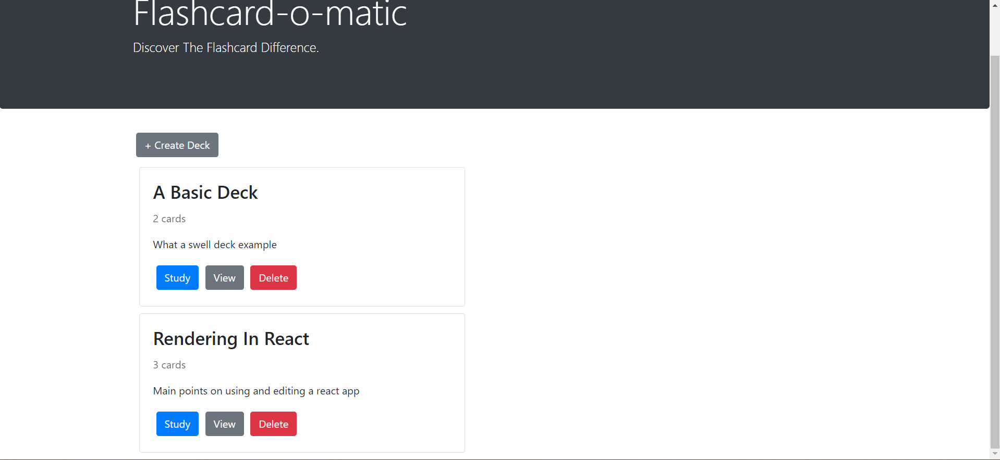
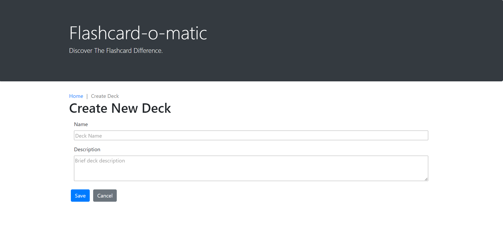
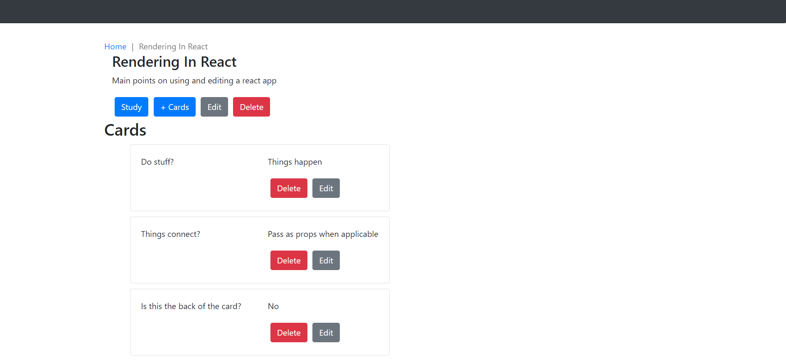
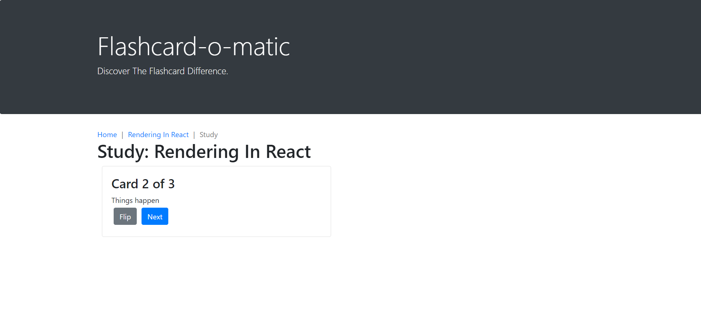

# Study_Flashcard-App
Capstone: Flashcard app to practice React 

Provides easy access to creating your own flashcards organized by deck.

Home:
    Create a new deck
    Shows list of decks, number of cards for each one, and options to view individual decks, study the deck, or delete one.

Create Deck:
    Form to name and provide brief description of a new deck.

Deck:
    Simple overview of deck details; can quicklt scroll through cards and edit or create new ones.

Study:
    Flip through cards
    On last one window will prompt either a restart or return to deck page

